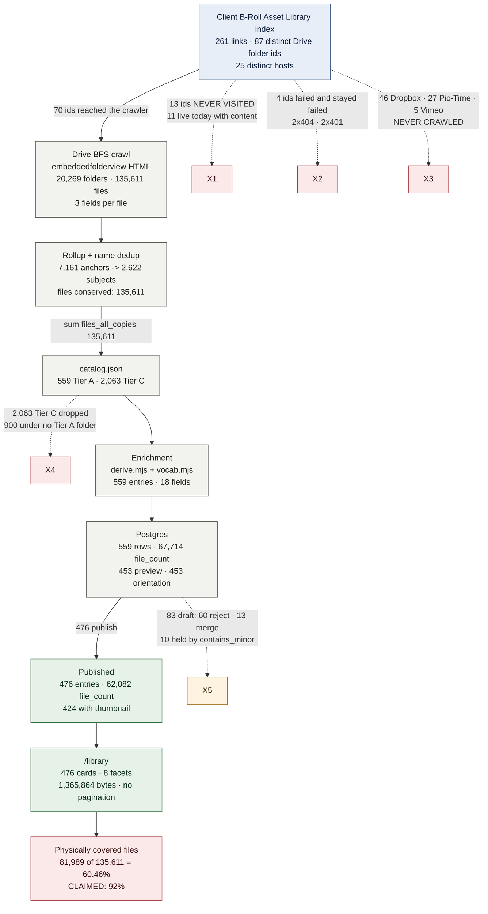

# FAMPIRE Media Center — Corpus Audit

**Date:** 2026-08-13 · **Scope:** ingestion → abstraction → traceability → discoverability

> **REMEDIATION APPLIED — see `docs/AUDIT-FIXES.md`.** All three CRITICALs and
> most HIGHs are closed. Coverage is now **92.9% measured** (127,019 of 136,798)
> because the merged folders are linked, not because the number was lowered —
> reproduce with `node scripts/verify-coverage.mjs`. The findings below are the
> state *as found*, kept intact as the record of what was wrong.
**Method:** every figure below was re-measured against the live database, the live site on
`127.0.0.1:3200`, the raw crawl JSON, and live Google Drive. Nothing is carried over on trust.

**Provenance markers used throughout:**

| Marker | Meaning |
|---|---|
| **[V]** | Verified by me in this audit run; the exact command is given |
| **[D]** | Measured by a parallel investigation, not independently re-run by me; treat as one source |
| DETERMINISTIC | Derived by rule from data; reproducible |
| HARDCODED | A constant in source code |
| HUMAN-AUTHORED | Written by a person, not computed |
| UNKNOWN | Cannot be determined from what exists |

---

## 1. Verdict

**The corpus is not comprehensively ingested, and the coverage figure given to the client is
wrong by a wide margin: only 81,989 of 135,611 crawled files (60.46%) physically sit inside a
published collection's Drive folder, against a written client claim of "covering 92% of the
archive"** — and even that 135,611 is not the true archive, because 13 Drive folder ids taken
from the client's own B-Roll Asset Library index were never visited by the crawler at all, 11 of
which are live and holding content today. **Abstraction is genuinely sound as a mechanism and
genuinely thin as a result:** all 18 generated fields re-derive from the stored `folder_path`
with zero mismatches [D], but on the 476 published entries location is 5.0%, event 22.5%,
occasion 28.2%, year 33.6%, and 155 entries (32.6%) name no person at all — so the machinery is
correct and the material it was given is too poor to describe the library. **Traceability is the
one unambiguous strength:** 559/559 entries carry a `folder_id` and a non-empty `folder_path`,
and I resolved sampled entries live back to Drive folders whose titles and file counts match
exactly. **Discoverability is materially weaker than it appears:** 8 facet axes over 476 entries,
free-text that is a case-folded substring match with no ranking (`?q=bio` returns 135 of 476,
`?q=master` returns 0 while 304 published entries have "master" in their folder path,
`?q=terza` returns 0), no sorting control, no pagination, and no file-level index of any kind
because **zero content was ever extracted from any file** — no OCR, no PDF text, no EXIF, no
transcripts, no checksums. **The honest summary is that this is a good-looking, correctly-built
folder-name catalog sitting on top of an incomplete crawl, and three of the numbers on the front
door and in the deliverable do not survive measurement.**

---

## 2. Inventory — the architecture as actually built

### 2.1 Ingestion and crawl

| Component | What it actually is | Provenance |
|---|---|---|
| Discovery transport | Unauthenticated HTML scrape of `drive.google.com/embeddedfolderview?id=<id>#list` | [V] `grep` over `~/Fampire/scripts/*.py` |
| Crawler code | 496 lines of Python **standard library only** — `urllib.request`, `re`, `concurrent.futures`. Zero third-party imports except `openpyxl` in a spreadsheet script | [D] |
| Traversal | Unbounded BFS to leaf depth; max root-distance 10; 9,088 folders at depth 10, none with children | [D] |
| Drive API | **Not used.** `googleapis` appears 0 times in `package-lock.json`; unauthenticated Drive API v3 returns 403 | [D] |
| Fields captured per file | **3** — filename, a 13-value thumbnail alt-text label, parent folder id | [D] |
| Fields present in the same HTML but discarded | Per-file last-modified date (rendered on 100% of sampled rows) and exact MIME type in the list-icon URL | [D] |
| Retry | `failed` array holds exactly **4** folder ids; all 4 still fail today (2× HTTP 404, 2× HTTP 401) | [V] live fetch of all 4 |
| Re-runnability | **None.** All 6 scripts require intermediates (`urls.txt`, `drive_tree.json`, `parents.json`, `rolled2.json`) that do not exist on disk. No crawl logs | [D] |

### 2.2 Content extraction

**There is none.** This is the single largest architectural absence.

| Capability | Status | Evidence |
|---|---|---|
| OCR / PDF text / transcription / embeddings / vector search / perceptual or content hashing / video metadata | **Zero.** 12 production dependencies, none a parser, OCR, search, hashing or ML library | [V] `node -e 'console.log(Object.keys(require("./package.json").dependencies))'` → 12 deps |
| `grep` for `tesseract\|whisper\|pdfjs\|unpdf\|ffprobe\|exif\|md5\|sha256\|phash\|typesense\|meilisearch\|elasticsearch\|lunr\|minisearch\|flexsearch\|googleapis\|pgvector` | 3 hits, **all false positives** — a filename-extension regex, a comment, a TODO | [D] |
| Bytes ever read from a client asset | Only 400px Drive **thumbnails**, fed to `sharp().metadata()` for width/height | [V] `scripts/enrich/sample-orientation.mjs:86,99,108` |
| `alt_text` populated | **0 of 559** | [V] `psql -tAc "select count(*) filter (where alt_text is not null and alt_text<>'') from entries"` → `0` |

### 2.3 Rollup, enrichment, storage, presentation

| Stage | File | Nature |
|---|---|---|
| Rollup + dedup | `~/Fampire/scripts/rollup2.py`, `final_catalog.py` | DETERMINISTIC; independently reproduced [D] |
| Source slicing | `scripts/enrich/extract-sources.mjs` | DETERMINISTIC |
| Orientation sampling | `scripts/enrich/sample-orientation.mjs` | DETERMINISTIC given the network; measured, not derived |
| Controlled vocabulary | `scripts/enrich/vocab.mjs` | **HARDCODED** — films, events, locations, occasions, kinds, 29 known people, stopwords, brand rules |
| All derivations | `scripts/enrich/derive.mjs` | DETERMINISTIC; 0/559 mismatches on re-derivation [D] |
| Import | `scripts/import-entries.ts` → Payload/Postgres 17.9 | 0 drift vs `entries.json` across 11 columns × 559 rows [D] |
| Read seam | `lib/fampire/payload-catalog.ts` | Hardcoded `limit: 2000`, hardcoded `sort: "-fileCount"` |
| Search + facets | `lib/fampire/catalog.ts` | In-process substring matcher over a 13-field haystack |
| UI | `app/(frontend)/(site)/**` | Some stats live, some HARDCODED (§6) |

**No LLM is used at runtime or in the pipeline.** I found nothing that looks generated. Confirmed.

---

## 3. Source-to-UI data flow, with counts



---

## 4. Corpus reconciliation

Every delta below is either explained or explicitly flagged unexplained.

| # | Stage | Count | Delta from prior | Explanation | Status |
|---|---|---:|---:|---|---|
| 0 | Client link index — total links | 261 | — | `broll-asset-library-links.json`. Hosts: Drive 108, Dropbox 46, Pic-Time 27, lollibrands.com 24, YouTube 5, Vimeo 5, +19 more. **[V]** | — |
| 1 | Distinct Drive folder ids in that index | 87 | — | **[V]** regex over the same file | — |
| 2 | Of those, reached by the crawl | 70 | −17 | 4 are the crawler's own permanent failures; 13 were **never visited** | **UNEXPLAINED GAP** |
| 3 | Never-visited ids, live today | 11 of 13 | — | Titles fetched live: `2. The Guru`, `9. sHEALed BTS`, `3. 12/15/2024 - Love and Legend A4M Oscars of Longevity`, `4. 1/20/2025 - Love and Legend MAHA Ball`, `5. 5/30/2025 - Love and Legend - Miami Fashion Week`, `6. 7/13/2025 - The Cold Collective`, `8. …Real Estate Award` (49 rows), `Bryan Johnson RAW BTS Videos` (90 rows), `Dr. Jigar Gandhi`, +2. **[V]** | **DEFECT — direct cause of Love=0, Legend=0, The Guru=5** |
| 4 | Files at seed depth in those 13, overlap with the 135,611 | 157 found · **0 overlap** | — | My BFS did not recurse into subfolders, so **157 is a floor, not a total**. A deeper parallel BFS reported 59 folders / 1,633 files, also 0 overlap **[D]**. | Floor established; true total UNKNOWN |
| 5 | Non-Drive sources crawled | **0** | −78 links | 46 Dropbox + 27 Pic-Time + 5 Vimeo links in the client's own index were never ingested. `source_platform` is `drive` for all 559 rows. **[V]** | **SCOPE GAP — deliberate but undisclosed** |
| 6 | Crawl output | 20,269 folders · **135,611 files** | — | **[V]** `node -e` over `drive-crawl-full.json` | Baseline |
| 7 | Crawl failures | 4 | — | All 4 recorded with empty name, hold no files, retried, still 404/401 today. **[V]** | Explained, closed |
| 8 | Rollup anchors → subjects | 7,161 → 2,622 | — | Name-normalisation dedup. Reproduced exactly from raw crawl **[D]** | Explained |
| 9 | File conservation through rollup | 135,611 | 0 | `sum(files_all_copies)` over all 2,622 rows = 135,611 exactly. **[V]** | Clean |
| 10 | Tier A selected | 559 rows | −2,063 rows | Tier C dropped. Of those, 1,163 (4,119 files) are reachable by descending into a Tier A folder; **900 (6,322 files) sit under no Tier A folder** **[D]** | **Partially unexplained loss** |
| 11 | Tier A claimed coverage | **125,170** `files_all_copies` | — | **[V]** `node -e` over `catalog.json`. This is the number behind the "92%" claim (125,170 / 135,611 = 92.3%) | **NOT A COVERAGE FIGURE — see #13** |
| 12 | Tier A deduped file count | 67,714 `files` | −57,456 | The head folder only. **[V]** | Explained |
| 13 | Files physically under any of the 559 entry folders | **87,426 (64.47%)** | −37,744 vs claim | `files_all_copies` sums folders that merely share a normalised name; the entry links to **one** of them and the other folder ids are recorded **nowhere**. **[V]** ancestor walk over `drive-folder-parents.json` vs `select folder_id from entries` | **THE HEADLINE DEFECT** |
| 14 | Postgres rows | 559 | 0 | **[V]** `psql -tAc "select _status,count(*) from entries group by 1"` → `draft\|83`, `published\|476` | Clean |
| 15 | Published | 476 | −83 | 60 reject (machine artifacts), 13 merge (wrong granularity), 10 held by the `contains_minor` gate. **[V]** `select import_disposition,_status,count(*) …` | Explained, intended |
| 16 | Files physically under a **published** entry folder | **81,989 (60.46%)** | −5,437 | **[V]** same ancestor walk restricted to `_status='published'` | **vs "92%" written to the client** |
| 17 | Files under **no** entry folder at all | **48,185 (35.53%)** | — | **[V]** | Unrepresented archive |
| 18 | Searchable / rendered | 476 | 0 | **[V]** `curl /library \| grep -oc 'href="/collections/'` → `476`; header reads "476 of 476" | Clean |
| 19 | With a thumbnail | 424 of 476 | −52 | 52 published entries render no preview. 453 of 559 overall. **[V]** `select count(*) filter (where preview_file_id is not null) from entries where _status='published'` → `424` | Explained (§7) |
| 20 | `file_count` summed across published entries | 62,082 | — | **[V]**. Note: **166 of 559 Tier A entries are nested inside another Tier A entry** **[D]**, so this sum double-counts and is not a corpus measure | Must not be published as a coverage stat |

### Non-asset content inside the 135,611

| Class | Count | % | Provenance |
|---|---:|---:|---|
| `.DS_Store`, `._*`, `Info.plist`, `Thumbs.db`, `desktop.ini`, and `.xml/.plist/.lock/.bdm/.ctg/.thm/.lrv/.aae/.xmp` sidecars | 17,665 | 13.0% | **[V]** |
| Final Cut render cache (`Frame N - M`) | 2,937 | 2.2% | **[V]** |
| **Combined junk** | **20,602** | **15.2%** | **[V]** — a parallel classifier reported 20,841 / 15.4% **[D]**; the difference is regex definition, not data |
| Files with no filename extension | 10,146 | 7.5% | **[V]** |
| Files with an **empty** crawler type string | 45,750 | 33.7% | **[V]** `Counter(v[1] for v in files.values())`, 13 distinct type strings |
| Camera-default filenames | 79,815 | 58.9% | **[V]** with my regex; 83,826 / 61.8% with a broader one **[D]**. BUILD-PLAN §7.4 claims 59% — **confirmed** |

**Implication:** the true media asset count is roughly **115,000**, not 135,611. Every ratio computed
against 135,611 is flattering by ~15%.

---

## 5. Every filter and searchable field today

Searchable = matched by the free-text box. Filterable = a UI control exists. Sortable = a user
can reorder by it.

| Field | In DB | Populated (of 476 published) | Searchable | Filterable | Sortable | Notes |
|---|---|---:|---|---|---|---|
| `title` | ✅ | 476 (100%) | ✅ substring | ❌ | ❌ | 465 distinct titles for 476 entries; 8 titles reused by 19 entries **[D]** |
| `description` | ✅ | 471 (98.9%) **[D]** | ✅ substring | ❌ | ❌ | 107 (22.5%) under-report file counts **[D]** |
| `kind` | ✅ | 476 (100%) | ✅ via aliases | ✅ 12 values | ❌ | 13 enum values defined, 12 used (`podcast` = 0 rows) **[V]** |
| `orientation` | ✅ | 424 (89.1%) | ❌ | ✅ 4 values | ❌ | Measured from ≤5 thumbnails (§7) |
| `occasion` | ✅ | **134 (28.2%)** | ❌ | ✅ 10 values | ❌ | **378 of 559 (67.6%) NULL** — they vanish from the facet entirely **[V]** |
| `tenant` (brand) | ✅ | 476 (100%) | ❌ | ✅ 2 values | ❌ | 7 brand rows exist; only 2 receive entries: lolli-brands 387, biohack-yourself 172 **[V]** |
| `people` (family) | ✅ | 91 (19.1%) | ✅ if name in title | ✅ **2 values only** | ❌ | TereZa 85, Anthony 8, **Love 0, Legend 0** **[V]** |
| `year` | ✅ | 160 (33.6%) | ✅ as a digit substring | ✅ 3 values | ❌ | **[V]** |
| `film` | ✅ | 327 (68.7%) | ✅ | ✅ 5 values | ❌ | 8 film rows; 3 have zero entries **[V]** |
| `event` | ✅ | 107 (22.5%) | ✅ | ✅ 11 values | ❌ | 11 event rows; the 12th vocab event never instantiated **[V]** |
| `location` | ✅ | **24 (5.0%)** | ❌ | ❌ **not exposed** | ❌ | 9 location rows exist. `?location=miami` is silently ignored → 476 **[D]** |
| `magazineIssue` | ✅ | 22 (4.6%) | ❌ | ❌ **not exposed** | ❌ | `?magazineIssue=2` ignored → 476 **[D]** |
| `people` (guests) | ✅ | 321 entries, 146 named | ✅ **only** because the name is templated into title+description | ❌ **not exposed** | ❌ | 146 guests, 0 exceptions **[D]** |
| `dateStart` / `dateEnd` | ✅ | 160 / 79 | ❌ | ❌ | ❌ | **[V]** |
| `fileCount` | ✅ | 476 | ❌ | ❌ | ❌ **hardcoded desc** | `sort: "-fileCount"` at `payload-catalog.ts:150` |
| `folderPath` | ✅ | 559 | ❌ | ❌ | ❌ | **304 published entries contain "master", 95 "deliverab*" — `?q=master` returns 0** **[V]** |
| `sourcePlatform` | ✅ | 559 (all `drive`) | ❌ | ❌ | ❌ | **[V]** |
| `resolutionClass` | ✅ | **0 of 559** | ❌ | ❌ | ❌ | Column exists, never populated **[V]** |
| `altText` | ✅ | **0** | ❌ | ❌ | ❌ | **[V]** |
| `tags` | ✅ table | **0 rows** | ❌ | ❌ | ❌ | `entries_tags` empty **[V]** |
| File names / file contents | ❌ | — | ❌ | ❌ | ❌ | **No file-level index exists anywhere** |

### Free-text search — measured behaviour

Implementation: `lib/fampire/catalog.ts:264-334` — `normalize()` case-folds, `haystack()` concatenates
13 fields, `matches()` does a substring test with a trailing-`s` hack, `search()` requires every
term to match. No ranking, no stemming, no fuzzy, no phrase, no boolean, no negation, no
multi-select.

| Query | Returns (of 476) | Truth | Verdict |
|---|---:|---|---|
| `?q=bio` | **135** | 1 entry actually contains the word | Substring false positives |
| `?q=pro` | **129** | 0 | Substring false positives |
| `?q=oll` | **392** | matches inside "Lolli" and "roll" | Substring false positives |
| `?q=drive` | **476** | "Google Drive" is folded into every haystack | Search is a no-op |
| `?q=cover` | 88 | 39 by word boundary **[D]** | 2.3× over-matching |
| `?q=master` | **0** | 304 published entries have it in `folder_path` | Client vocabulary invisible |
| `?q=deliverables` | **0** | 95 entries | Client vocabulary invisible |
| `?q=tereza` | 85 | correct | ✅ |
| `?q=terza` | **0** | 1-char typo | No fuzzy tolerance |

All **[V]** via `curl -s "http://127.0.0.1:3200/library?q=…" \| grep -oc 'href="/collections/'`.

### Structural limits

| Property | Measured | Provenance |
|---|---|---|
| Facet axes rendered | **8** (Kind, Orientation, Occasion, Brand, Person, Year, Film, Event) | **[V]** `grep -oE 'border-t-2 border-fam-ink pt-3">[^<]+'` |
| Cards per page | **476, all of them** — no pagination, no "load more" | **[V]** `grep -oiE '<select\|>Sort\|Relevance\|Newest\|Load more\|pagination'` → **no output** |
| `/library` HTML weight | **1,365,864 bytes** (~2.87 KB/card) | **[V]** `wc -c` |
| Sorting control | **None** | **[V]** same grep |
| Hard result cap | `limit: 2000` at `payload-catalog.ts:145`, no pagination — silent truncation past 2,000 entries | **[V]** |
| Unknown query params | Silently ignored; return the full 476 with HTTP 200 (20 params tested) | **[D]** |
| Payload REST API | **Publicly reachable** at `/payload-api/entries` and **does** support the missing filters (`where[location][exists]=true` → 24). No draft leak (`_status=draft` → 0) | **[D]** |
| Published entries reachable by **no** category | **23** — no occasion, no year, no film, no event, no family person | **[V]** |
| Published entries naming **nobody** | **155 (32.6%)** | **[V]** |

---

## 6. Hardcoded assumptions and predefined categories

| # | What | Where | Measured reality | Should it be data? |
|---|---|---|---|---|
| 1 | **`8 documentary films`** on the home page | `app/(frontend)/(site)/page.tsx:121` — `FILMS.length` | HARDCODED. Only **5 films carry published entries**; `stats().films` computes the honest figure in the same function and **discards it**. Live page renders `476 / 8 / 11` **[V]** | **Yes — read `loadFilms()`, or label it "titles in the slate"** |
| 2 | `streaming on eleven platforms` | `page.tsx:216` | HARDCODED, stated twice. 25 watch links / **10 distinct platforms** exist in the un-migrated array; `films_watch` has **0 rows** and the section publicly renders "0 of 0 are free to stream" **[V]/[D]** | **Yes — migrate to `films_watch`** |
| 3 | `FILMS`, `FILM_AWARDS`, `PEOPLE`, `SUBJECT_LABEL` | `lib/fampire/catalog.ts` | HARDCODED. `/films`, `/people` and the masthead were rewired to the CMS; **the home page was not** | **Yes** |
| 4 | `films.synopsis` | Postgres | Column exists, **0 characters for all 8 films**, read by nothing. The `SYNOPSIS` map in `films/page.tsx` is the only source | **Yes — the CMS field is dead weight until wired** |
| 5 | Controlled vocabulary | `scripts/enrich/vocab.mjs` | HARDCODED: 8 films (3 never fire), 12 events (1 never fires), 13 locations (4 never fire), 11 occasions, 13 kinds, **29 known people of whom 5 are unreachable** because they also appear in `PERSON_STOPWORDS` **[D]** | **Yes — client-editable in the admin** |
| 6 | `DOMINANT_KIND[dominant] ?? "b-roll"` | `derive.mjs:275` | **Silent catch-all.** 82 of 559 entries are labelled b-roll purely because nothing matched; 59 have zero video files; 24 published, 7 of those with zero video **[D]** | **Yes — emit `unclassified`, do not fabricate a kind** |
| 7 | `occasion` has **no** catch-all | `derive.mjs` | **378 of 559 (67.6%) NULL** — they disappear from the Occasion facet entirely **[V]** | **Yes — an explicit "unspecified" bucket** |
| 8 | First-match-wins vocabulary order | `vocab.mjs` list order | 17 entries match >1 film, 31 match >1 event; `a4m-red-carpet` beats `biohack-premiere` every time, so `biohack-premiere` has **0 rows** in Postgres (11 of 12 events instantiated) **[V]/[D]** | **Yes — score matches, or allow multiple** |
| 9 | `BRAND_RULES` catch-all `/.*/ ` | `vocab.mjs` | 343 of 476 published (72.1%) land in `lolli-brands` via the catch-all. 7 brand rows exist, only 2 receive entries **[V]/[D]** | **Yes** |
| 10 | `sort: "-fileCount"` | `payload-catalog.ts:150` | HARDCODED. Search is a filter, not a ranker — the best match can render 400 cards down | **Yes — relevance ranking + a sort control** |
| 11 | `limit: 2000` | `payload-catalog.ts:145` | HARDCODED with no pagination. Silent truncation is the real break point, well before any algorithmic limit | **Yes — paginate** |
| 12 | `KIND_ALIASES`, `PLATFORM_LABEL` in the haystack | `catalog.ts:251+` | HARDCODED. `PLATFORM_LABEL` = "Google Drive" is folded into every haystack, so `?q=drive` and `?q=google` each return all 476 **[V]** | **Yes — exclude from the haystack** |
| 13 | Four home-page LANES | `page.tsx` | HARDCODED. Behind them: b-roll 175, event photography 172, **press 1, headshots 1** **[V]** | **Yes — or drop the two empty lanes** |
| 14 | Five home-page search chips | `page.tsx` | HARDCODED. Results: MAHA Ball 11, trailer 1, headshots 1, 2025 106, TereZa 85 **[D]** | Acceptable as curation; the 1-result chips are not |
| 15 | `/clip-them` Vertical vs Horizontal | CMS page 4 | **Both rows render the byte-identical 6 collections in identical order.** `pages_blocks_entry_query` has **no `orientation` column**, so Payload silently dropped the seeded filter **[V]** — verified: columns are `eyebrow, heading, intro, layout, limit, filters_brand_id, filters_film_id, filters_event_id, filters_location_id, filters_year, filters_exclude_minors, sort, view_all, block_name` | **Yes — add the field; this page actively misinforms** |
| 16 | `/films/biohack-yourself` "From the production" | CMS page 6 | `filters_film_id` is NULL — the block presents **the whole catalog's top 9 by file count** as Biohack Yourself material, including an Andrew Tate cover shoot **[D]** | **Yes — same fix; also misinforms** |
| 17 | Page blocks | `collections/` | **16 defined, 6 used.** `lanes, peopleRow, filmStrip, searchBar, entryPicks, quote, faq, embed, columns, divider` all have 0 rows **[V]** | Dead surface area |
| 18 | Hero Vimeo id | `lib/fampire/media.ts` | HARDCODED `1025829605`. **Embed returns 401, oEmbed returns 200** — the video is public but its embed is domain-restricted and `localhost` is not allowlisted **[V]** | Config, not code |
| 19 | `"covering 92% of the archive"` | `deliverables/FAMPIRE-Deliverables-Plain.html` | **HUMAN-AUTHORED.** Matches 125,170/135,611. **Actual physical coverage is 60.46% published / 64.47% all** **[V]** | **Must be corrected before it goes further** |

---

## 7. The thumbnail selection pipeline, end to end

`scripts/enrich/sample-orientation.mjs` → `data/fampire/orientation.json` → `entries.previewFileId`
→ `payload-catalog.ts:72,88` → `components/fampire/Preview.tsx`.

| Step | What happens | Measured | Provenance |
|---|---|---|---|
| 1. Candidate selection | Up to **5** file ids per collection from `data/audit/drive-sample-candidates.json` (`per: 5`) | 539 folders queued | **[V]** `orientation.json.per` = 5 |
| 2. Fetch | `https://drive.google.com/thumbnail?id=<id>&sz=w400`, retried to `MAX_ATTEMPTS` | **4,238 fetch attempts**, `unresolved: 0` | **[V]** sum of `attempted` |
| 3. Decode | `sharp(buf).metadata()` → `{width, height}`. Rejected if <40px (Drive's generic file icon) | **2,173 usable frames — 51.3% yield** | **[V]** |
| 4. Classify | ±10% of square = `square`; else portrait/landscape. `≥0.6` share names the collection, else `mixed` | landscape 308 · portrait 136 · square 7 · mixed 2 · **null 86** | **[V]** |
| 5. Preview id | The first usable frame becomes `previewFileId` | 453 of 559 · **424 of 476 published** · **52 published render nothing** | **[V]** |
| 6. Render | `https://drive.google.com/thumbnail?id=<id>&sz=w800`; `Preview.tsx:28` rewrites `sz=w<width>` | **302 → `lh3.googleusercontent.com/d/<id>=w800`**; the 302 carries `cache-control: no-cache, no-store` | **[V]** live `curl -D -` |
| 7. Optimisation | **None.** `next/image` used **0 times**; no local cache, no CDN | **[V]** `grep -rn "next/image" app components lib \| wc -l` → `0` |

### The defect in this pipeline

The orientation label is a **≤5-frame sample presented as a property of the whole collection**, and
the sample fraction collapses on exactly the collections that matter most:

| Entry | Files | Samples | Confidence | Fraction sampled |
|---|---:|---:|---:|---:|
| A4M Red Carpet — Interviews | 6,563 | 5 | 1.00 | **0.0762%** |
| Sit Down Interview Productions | 5,382 | 5 | 1.00 | **0.0929%** |
| Ashton Hall — Issue #8 | 3,202 | 5 | 1.00 | **0.1562%** |
| Andrew Tate — Cover shoot | 2,781 | 5 | 1.00 | **0.1798%** |
| Hack Your Health | 2,679 | 5 | 0.60 | **0.1866%** |

**[V]** `psql -tAc "select title, file_count, orientation, orientation_samples, orientation_confidence, round(100.0*orientation_samples/nullif(file_count,0),4) from entries where _status='published' order by file_count desc limit 8"`

Additionally: **23 collections were decided on fewer than 3 frames** and **42 carry confidence
< 0.70** [V]. A confidence of `1.00` on 5 of 6,563 files is not evidence; it is the arithmetic of a
tiny sample. `resolution_class` is NULL for all 559 despite dimensions being read [V].

---

## 8. Why resources are missing or underrepresented

| Cause | Files / entries affected | Numbers | Provenance |
|---|---:|---|---|
| **A. Seeds never visited** | 13 folder ids, ≥157 files (floor) | From the client's own index. 11 live today. Includes `2. The Guru`, `9. sHEALed BTS`, and **all three Love and Legend event roots** — this is the direct, sufficient cause of `Love = 0`, `Legend = 0`, and `the-guru = 5` | **[V]** |
| **B. Non-Drive platforms never crawled** | 78 links | 46 Dropbox, 27 Pic-Time, 5 Vimeo. `source_platform='drive'` for all 559 rows. The legacy hand-authored catalog had 34 non-Drive entries (23 Dropbox, 7 Pic-Time, 2 Vimeo) — **all silently dropped** when the pipeline switched to the Drive-only audit catalog | **[V]/[D]** |
| **C. Dedup collapses folders and records only one** | **37,744 files** claimed but not linked | 844 subject groups merged >1 folder. 175 distinct "M4ROOT" camera-card folders became one entry claiming 4,696 files; 67 "Shealed Logos" folders became one claiming 1,211. `entries_alternates` has **0 rows**; `catalog.json` has no member list; the intermediates that held `members` (`rolled2.json`, `parents.json`) **do not exist**. The other folder ids are **unrecoverable** | **[V]/[D]** |
| **D. Tier C dropped** | 900 subjects, 6,322 files | Sit under **no** Tier A folder — unreachable by browsing. A further 85 Tier C rows (3,721 files) would be Tier A if the threshold used `files_all_copies` | **[D]** |
| **E. Filenames carry no signal** | 79,815 files (58.9%) | Camera defaults. BUILD-PLAN §7.4's 59% claim **confirmed**. All metadata therefore comes from folder path | **[V]** |
| **F. Metadata discarded at scrape time** | 45,750 empty types (33.7%), 10,146 no extension | The same HTML carried a per-file **last-modified date** (100% of rows) and an exact **MIME type** in the icon URL. Both thrown away. In one 1,526-row folder, 763 files typed `''` were `image/x-sony-arw` in the HTML | **[V]/[D]** |
| **G. No content extraction** | All 135,611 | No OCR, PDF text, EXIF, video metadata, transcripts, or checksums. Nothing inside any file is searchable | **[V]** |
| **H. Vocabulary too small** | 643 unmatched proper-noun candidates across 559 entries; 1,571 across all 20,269 folder names | 194 distinct "Dr X" strings exist in folder names; 146 people reach entries. **35 brand-partner CEO/founder names** appear in entry `folder_paths` and attach to **no entry** | **[D]** |
| **I. Person identity fragmentation** | ~26 duplicates in 127 records (20%) | 17 surname-vs-fullname pairs (`Dr. Werber` / `Dr. Bruce Werber`), 9 spelling variants at edit distance ≤2 (`Dr. Aimie/Amie Hornaman`, `Dr. Cody Kreigel/Kriegel`) | **[D]** |
| **J. Over-attribution** | 85 entries | **Adam Chani — the BTS cinematographer — is credited as "Featuring" on 85 published entries, in 85/85 cases from an ancestor folder name only.** 78 of 85 TereZa attributions come from an "owned by TereZa" **rights label**, not from her being in frame. Same pattern: Dr. Sabrina Solt 13/13, Chris Jackson 13/13, Dr. Gabrielle Lyon 11/11 | **[D]** — high-confidence, single source |
| **K. Junk counted as assets** | 20,602 files (15.2%) | Sidecars + Final Cut render cache. True media count ≈115,000 | **[V]** |

---

## 9. Library and technology assessment

### What is used

| Library | Version | Role | Fit |
|---|---|---|---|
| `next` + `react` + `react-dom` | — | App shell | ✅ Appropriate |
| `payload` + `@payloadcms/db-postgres` + `@payloadcms/next` + `richtext-lexical` + `plugin-multi-tenant` | — | CMS, schema, admin, tenancy | ✅ Correct choice; DB is 25 MB, `media` table has **0 rows** — **the no-migration constraint is architecturally honoured** [D] |
| `sharp` | 0.35.3 (Apache-2.0, current) | The **only** pixel-touching package; used in exactly 2 places | ✅ Right tool, under-used |
| `framer-motion`, `lenis`, `graphql` | — | Presentation | ✅ Fine |
| Python stdlib (`urllib`, `re`, `concurrent.futures`) | — | The entire crawler, 496 lines | ⚠️ Adequate for a one-shot scrape; **fatally limited on metadata** and **not re-runnable** |

**12 production dependencies. Not one is a crawler, parser, OCR, search, hashing or ML library** [V].

### Is the in-process search adequate?

Yes on latency, no on quality. Measured: 0.256 ms/query over the real 559 entries [D]; live page
latency 205–350 ms end-to-end, **dominated by render, not search** (a zero-result query still costs
~270 ms) [D]. Scaling is strictly linear — 90 ms/query at 135,611 entries [D]. **The real wall is
the hardcoded `limit: 2000` with no pagination, not the algorithm.** Replacing the search engine
would fix nothing that users are actually hitting; replacing the *matching semantics* would fix a lot.

### What to adopt

| Priority | Change | Cost | Why it earns its place |
|---|---|---|---|
| **1** | **Drive API v3 instead of the HTML scrape** | ~**2,026,900 quota units** for a full re-traverse = **0.507% of the 400M/day allowance**, ~2 min of the per-minute cap [D] | Delivers `mimeType` for 10,146 extension-less files, `modifiedTime` for date facets, `md5Checksum` (makes the duplication question answerable **for the first time**), and `imageMediaMetadata`/`videoMediaMetadata` — replacing 4,238 thumbnail fetches and a 5-frame sample standing in for a 6,563-file folder. `changes.list` gives incremental refresh at 100 units per 1,000 changes. **Highest leverage change in the entire system.** |
| **2** | **`pg_trgm` (1.6) + `unaccent` (1.1)** — already available, uninstalled | One migration | Fixes typo intolerance (`terza`) and mid-word false positives without discarding the alias bridging. Verified available: `pg_trgm 1.6`, `vector 0.8.2`, `unaccent 1.1`, `fuzzystrmatch 1.2`, `btree_gin 1.3` — **installed: `plpgsql` only** [V] |
| **3** | Word-boundary matching + a stopword list in `catalog.ts` | ~20 lines | `?q=bio` 135→~1, `?q=drive` 476→0. No dependency needed |
| **4** | Persist merged-folder membership (`entries_alternates`) | Schema + re-run rollup | Makes the coverage claim *provable* instead of asserted. Currently unrecoverable |
| **5** | `next/image` or a thumbnail cache | Small | Currently 0 usages; Drive's 302 sets `cache-control: no-store`; an og:image fetch took 2.75 s [D] |
| **6** | `sitemap.xml` + `robots.txt` + JSON-LD | Small | All three absent: `sitemap.xml` **404**, `robots.txt` **404**, 0 JSON-LD files [V] |

### What to reject

| Rejected | Reason |
|---|---|
| **Typesense / Meilisearch / Elasticsearch** | 476 entries. Search costs 0.256 ms. Adding an engine adds an operational surface the client must run, against a **non-negotiable "deployment is the client's"** constraint. Reject. |
| **`pgvector` / embeddings** | Available (0.8.2) but there is no text to embed — descriptions are templated from the same folder path the facets already use. Embeddings over templated text retrieve nothing new. Reject **until** content extraction exists. |
| **`to_tsvector` alone as a replacement** | Measured: fixes `bio` 135→0 and `cover` 88→11, but **destroys the alias bridging — `photos` 172→0, `clips` 180→0** — and costs **11.85 ms unindexed on 559 rows, 46× slower** than the current path [D]. Use trigram *alongside* the existing matcher, not tsvector instead of it. |
| **OCR / Whisper / ffprobe at this stage** | Would require reading 135,611 files the contract says never to touch or host. Only viable against Drive API metadata, not file bytes. Reject for this engagement. |
| **Rewriting the crawler in Python with third-party deps** | The scrape is not the problem; the *endpoint* is. Go to the API (adopt #1) rather than harden the scrape. |

**One correction to a common assumption:** the `embeddedfolderview` endpoint does **not** paginate
and does **not** cap subfolder listings. Five largest folders re-fetched live returned
3202/2238/1601/1526/1114 rendered rows against 3202/2238/1601/1526/1114 recorded — exact — and the
three widest parents returned 431/430/409 subfolders, exact. A 200-folder random live re-crawl
matched the 4-Aug snapshot perfectly: 1,143 files vs 1,143, 0 missing edges, 0 failures [D].
**The crawl transport is sound. The seed list and the field capture are what failed.**

---

## 10. Prioritised defects

| # | Sev | Area | Defect | Evidence | Fix |
|---|---|---|---|---|---|
| 1 | **CRITICAL** | Client claim | **"covering 92% of the archive" is false.** Actual physical coverage is **60.46%** published / **64.47%** all entries | **[V]** ancestor walk: 81,989 / 87,426 / 135,611. The 92% derives from `files_all_copies` = 125,170, which sums name-matched folders the entries do not link to | Correct the deliverable to state 60.5%, or link the alternates so the claim becomes true. **Do not ship the 92% again** |
| 2 | **CRITICAL** | Ingestion | **13 client-supplied Drive folder ids were never crawled**; 11 are live with content today | **[V]** live fetch — `2. The Guru`, `9. sHEALed BTS`, three `Love and Legend` event roots, `Bryan Johnson RAW BTS Videos` (90 rows). Zero overlap with the 135,611 | Crawl them. This alone likely resolves the `Love = 0` / `Legend = 0` defect |
| 3 | **CRITICAL** | Ingestion | **Merged-folder membership is unrecoverable.** 844 groups collapsed; the other folder ids are recorded nowhere | **[V]** `entries_alternates` = 0 rows; `catalog.json` has no member list; `rolled2.json`/`parents.json` absent | Re-run rollup persisting `members[]`; add `entries_alternates` rows |
| 4 | **HIGH** | Attribution | **85 published entries credit the BTS cinematographer as "Featuring"**; 78 of 85 TereZa credits come from an "owned by TereZa" rights label | **[D]** 85/85 ancestor-only | Distinguish *credited crew* / *rights holder* / *in frame*. This is a reputational defect, not a data one |
| 5 | **HIGH** | UI truth | **`/clip-them` renders identical Vertical and Horizontal rows** — the block schema has no `orientation` field, so Payload silently dropped it | **[V]** identical 6 slugs twice; `\d pages_blocks_entry_query` shows no orientation column | Add the field to the block; re-seed |
| 6 | **HIGH** | UI truth | **`/films/biohack-yourself` presents the whole catalog's top 9 as Biohack Yourself material**, incl. an Andrew Tate cover shoot | **[D]** `filters_film_id` NULL on block `_parent_id=6` | Set the filter, or make the field required |
| 7 | **HIGH** | UI truth | **"8 documentary films" is hardcoded**; 5 films carry entries, 3 carry zero. "Eleven platforms" is hardcoded while `films_watch` has 0 rows and the page renders "0 of 0 are free to stream" | **[V]** `page.tsx:121` `FILMS.length`; `select count(*) from films_watch` → 0 | Read `loadFilms()`; migrate watch links; or relabel honestly |
| 8 | **HIGH** | Discoverability | **Client folder vocabulary is invisible.** `?q=master` → 0 while 304 published entries have "master" in `folder_path`; `?q=deliverables` → 0 while 95 do | **[V]** | Add `folderPath` to the haystack, or expose it as a filter |
| 9 | **HIGH** | Discoverability | **Substring matching produces mass false positives.** `?q=bio` → 135, `?q=pro` → 129, `?q=drive` → 476 | **[V]** | Word-boundary matching; drop `PLATFORM_LABEL` from the haystack |
| 10 | **HIGH** | Metadata | **Zero content extraction and zero checksums.** Duplication across 135,611 files is **unanswerable**; 66.2% share a filename with another file **[D]** | **[V]** 12 deps, no parser; `arrayBuffer()` only on thumbnails | Adopt Drive API `md5Checksum` (§9 #1) |
| 11 | **MEDIUM** | Metadata | **45,750 files (33.7%) have an empty type** and 10,146 have no extension, while the scraped HTML carried the exact MIME type and a last-modified date that were discarded | **[V]/[D]** | Drive API `mimeType` + `modifiedTime` |
| 12 | **MEDIUM** | Thumbnails | **Orientation on the largest collections rests on 0.076%–0.19% of files**, some at confidence 1.00; 23 collections decided on <3 frames; 42 below 0.70 confidence | **[V]** | Raise sample size, or hide orientation below a sample threshold |
| 13 | **MEDIUM** | Thumbnails | **52 published entries render no preview**; 106 of 559 overall have neither preview nor orientation | **[V]** | Re-sample; several were `.ARW` negatives with no Drive thumbnail |
| 14 | **MEDIUM** | Categories | **`occasion` is NULL on 378 of 559 (67.6%)** and those entries vanish from the facet; `kind` has a silent `?? "b-roll"` catch-all hitting 82 entries, 59 with zero video | **[V]/[D]** | Explicit "unspecified" bucket; emit `unclassified` instead of guessing |
| 15 | **MEDIUM** | Discoverability | **Location (24), magazineIssue (22), guest people (321), dates (160/79) are in the DB and exposed nowhere.** Unknown params silently return all 476 | **[V]/[D]** | Add facets; return 400 on unknown params |
| 16 | **MEDIUM** | Scale | **`limit: 2000` with no pagination** — silent truncation; `/library` ships 1,365,864 bytes for 476 cards | **[V]** | Paginate |
| 17 | **MEDIUM** | Scope | **Dropbox (46), Pic-Time (27), Vimeo (5) links never ingested**; 34 hand-authored non-Drive entries silently dropped. `source_platform='drive'` for all 559 | **[V]/[D]** | Ingest, or state the Drive-only scope explicitly to the client |
| 18 | **MEDIUM** | Data quality | **~26 duplicate person identities in 127 records (20%)**; 35 brand-partner names present in `folder_path` attach to no entry | **[D]** | Identity resolution pass |
| 19 | **LOW** | Ranking | **No sorting control; search is a filter, not a ranker** — best match can render 400 cards down | **[V]** | Relevance score + sort control |
| 20 | **LOW** | Ops | **Crawlers are not re-runnable** — required intermediates absent, no logs | **[D]** | Rebuild as an idempotent Drive API job |
| 21 | **LOW** | SEO | `sitemap.xml` **404**, `robots.txt` **404**, 0 JSON-LD, 0 `next/image` | **[V]** | Add all four |
| 22 | **LOW** | Hero | Vimeo `1025829605` **embed 401 / oEmbed 200** — public video, domain-restricted embed, `localhost` not allowlisted | **[V]** | Allowlist the deploy domain in Vimeo privacy settings. **Config, not code** |
| 23 | **LOW** | Dead surface | 16 page blocks defined, 6 used; `films.synopsis` empty and unread; `resolution_class` NULL 559/559; `entries_tags`/`articles`/`appearances`/`magazine_issues`/`media`/`films_watch` all 0 rows | **[V]** | Remove or populate |

---

## 11. Implementation plan

Ordered by (client risk × cost to fix). Items 1–3 should land before anything else is shown to the client.

| # | Action | Files to change | Why these files |
|---|---|---|---|
| **1** | **Correct the coverage claim** to 60.5% published / 64.5% catalogued, and stop publishing `files_all_copies` as coverage | `deliverables/FAMPIRE-Deliverables-Plain.html`; any place `125,170` or `92%` appears | This is the one number the client will repeat externally. It is wrong by 32 points. Everything else can wait; this cannot |
| **2** | **Crawl the 13 missing seeds** and re-run rollup + enrich + import | New idempotent crawl job; `~/Fampire/data/drive-crawl-full.json`; `scripts/enrich/build-entries.mjs`; `scripts/import-entries.ts` | The 11 live folders include all three Love and Legend event roots and `9. sHEALed BTS`. Fixing this is the cheapest path to closing the "0 collections" defect the client already noticed |
| **3** | **Persist merged-folder membership** — add `members[]` to the rollup output and write `entries_alternates` rows | `~/Fampire/scripts/rollup2.py`, `final_catalog.py`; `collections/Entries.ts`; `scripts/import-entries.ts`; a new migration in `migrations/` | Without this, "these 4,696 files are in this collection" is an assertion no one can check. `entries_alternates` already exists with 0 rows — the schema is half-built |
| **4** | **Fix the two misinforming CMS pages** — add `orientation` to the entry-query block; set `filters_film_id` on the Biohack Yourself block | `collections/Pages.ts` (block definition); new migration; re-seed script | Payload dropped an unknown seeded field **silently**. Any other seeded filter not in the block schema is also being dropped — audit the whole block while in here |
| **5** | **De-hardcode the home page stats** — read `loadFilms()`; label the films stat honestly; migrate watch links into `films_watch` | `app/(frontend)/(site)/page.tsx:121,216`; `lib/fampire/payload-catalog.ts`; `collections/Films.ts` | `stats().films` already computes the honest number and throws it away. The fix is deleting a constant, not adding a feature |
| **6** | **Fix search semantics** — word-boundary matching, drop `PLATFORM_LABEL` from the haystack, add `folderPath` | `lib/fampire/catalog.ts:251-334` | One file, ~20 lines, fixes defects 8 and 9 together. No dependency, no migration |
| **7** | **Install `pg_trgm` + `unaccent`; add a trigram index on title/description/folderPath** | New migration in `migrations/`; `lib/fampire/payload-catalog.ts` | Both are already available in this Postgres 17.9 install. Adds typo tolerance without an operational surface the client must run |
| **8** | **Expose the hidden facets** — location, magazineIssue, guest people, date range; reject unknown params | `lib/fampire/catalog.ts` (facet definitions); `app/(frontend)/(site)/library/page.tsx` | The data is already in the DB and the Payload REST API already filters on it. This is a UI gap, not a data gap |
| **9** | **Paginate `/library`** and remove `limit: 2000` | `lib/fampire/payload-catalog.ts:145,150`; library page component | 1.37 MB per page load today; silent truncation past 2,000 entries |
| **10** | **Move to Drive API v3** for metadata: `mimeType`, `modifiedTime`, `md5Checksum`, `imageMediaMetadata`, `videoMediaMetadata` | New crawl job replacing `~/Fampire/scripts/crawl2.py`; `collections/Entries.ts` for the new fields; migration | 0.507% of daily quota. Fixes defects 10, 11, 12 and 13 in one pass and makes the crawl re-runnable |
| **11** | **Re-derive with the richer metadata** — real orientation from `imageMediaMetadata`, real dates from `modifiedTime`, `resolution_class` populated | `scripts/enrich/derive.mjs`; `scripts/enrich/sample-orientation.mjs` (retire the thumbnail sampler) | Once #10 lands, the 5-frame sampler is obsolete and `resolution_class` becomes computable |
| **12** | **Fix attribution semantics** — separate credited crew / rights holder / in-frame subject | `scripts/enrich/derive.mjs`; `scripts/enrich/vocab.mjs`; `collections/Entries.ts`; `components/fampire/EntryCard.tsx` | "Featuring Adam Chani" on 85 collections is a claim about who is in the frame, sourced from a folder name that says who shot it |
| **13** | **Category honesty** — replace `?? "b-roll"` with `unclassified`; add an "unspecified" occasion; score vocabulary matches instead of first-match-wins | `scripts/enrich/derive.mjs:275`; `scripts/enrich/vocab.mjs` | Removes a silent fabrication and surfaces the 378 NULL-occasion entries instead of hiding them |
| **14** | **Person identity resolution** — merge surname/fullname pairs and edit-distance-≤2 variants | `scripts/enrich/vocab.mjs`; a one-off merge script; `people` table | 20% of extracted person records are duplicates |
| **15** | **Decide the non-Drive scope explicitly** — ingest Dropbox/Pic-Time/Vimeo, or write the limitation into the deliverable | `scripts/enrich/extract-sources.mjs`; `collections/Entries.ts` (`sourcePlatform`); deliverable | 78 links in the client's own index. Either is defensible; silence is not |
| **16** | **SEO + delivery** — `sitemap.xml`, `robots.txt`, JSON-LD, `next/image` | `app/(frontend)/sitemap.ts`, `robots.ts`; `components/fampire/Preview.tsx` | All four absent today |
| **17** | **Allowlist the deploy domain in Vimeo** | Vimeo privacy settings — **no code change** | Embed 401 / oEmbed 200 proves the video is fine and the domain is not allowlisted |
| **18** | **Remove dead surface** — 10 unused blocks, `films.synopsis`, `resolution_class` if not populated by #11 | `collections/Pages.ts`, `collections/Films.ts` | Every unused field is a place the client can enter data that renders nowhere |

---

## 12. Verification steps

Each block **proves** the corresponding fix. Run before and after; the "pass" column is the post-fix assertion.

### Fix 1 — coverage claim corrected

```bash
grep -oE '9[0-9](\.[0-9])?%|125,170' /Users/abishaikc/fampire-media-center/../Fampire/deliverables/*.html
# PASS: no output (no 92% / 125,170 remains)
psql -tAc "select folder_id from entries where _status='published'" fampire_media_center > /tmp/pub.txt
# then re-run the ancestor walk; PASS: the deliverable's stated % equals the measured %
```

### Fix 2 — the 13 seeds are ingested

```bash
node -e 'const fs=require("fs");
const j=JSON.parse(fs.readFileSync("/Users/abishaikc/fampire-media-center/data/fampire/sources/broll-asset-library-links.json","utf8"));
const arr=Array.isArray(j)?j:Object.values(j).find(v=>Array.isArray(v));
const ids=new Set(); for(const r of arr){const u=r.url||r.href||r; const m=(""+u).match(/(?:folders\/|id=)([A-Za-z0-9_-]{20,})/); if(m && (""+u).includes("drive.google")) ids.add(m[1]);}
const d=JSON.parse(fs.readFileSync("/Users/abishaikc/Fampire/data/drive-crawl-full.json","utf8"));
console.log("uncrawled:", [...ids].filter(i=>!Object.prototype.hasOwnProperty.call(d.folders,i)).length);'
# BEFORE: uncrawled: 13   PASS AFTER: uncrawled: 0

psql -tAc "select p.slug, count(distinct e.id) from people p left join entries_rels r on r.people_id=p.id left join entries e on e.id=r.parent_id and e._status='published' where p.slug in ('love','legend') group by 1" fampire_media_center
# BEFORE: love|0, legend|0   PASS AFTER: both > 0
psql -tAc "select f.slug, count(e.id) filter (where e._status='published') from films f left join entries e on e.film_id=f.id where f.slug='the-guru' group by 1" fampire_media_center
# BEFORE: the-guru|5   PASS AFTER: > 5
```

### Fix 3 — merged membership is provable

```bash
psql -tAc "select count(*) from entries_alternates" fampire_media_center
# BEFORE: 0   PASS AFTER: > 0

# Conservation test — every claimed file must be reachable from a linked folder:
psql -tAc "select sum(file_count) from entries where _status='published'" fampire_media_center
# then re-run the ancestor walk over folder_id UNION entries_alternates.folder_id
# PASS: measured reachable count >= sum(files_all_copies) of published entries
```

### Fix 4 — CMS pages no longer misinform

```bash
psql -c '\d pages_blocks_entry_query' fampire_media_center | grep -c orientation
# BEFORE: 0   PASS AFTER: 1
curl -s http://127.0.0.1:3200/clip-them | grep -oE '/collections/[a-z0-9-]+' | head -12 | sort | uniq -d
# BEFORE: 6 duplicate slugs   PASS AFTER: no output
psql -tAc "select filters_film_id from pages_blocks_entry_query where _parent_id=6" fampire_media_center
# BEFORE: (null)   PASS AFTER: the biohack-yourself film id
curl -s http://127.0.0.1:3200/films/biohack-yourself | grep -oE '/collections/[a-z0-9-]+' | sort -u > /tmp/shown.txt
psql -tAc "select slug from entries e join films f on f.id=e.film_id where f.slug='biohack-yourself' and e._status='published'" fampire_media_center | sort > /tmp/real.txt
comm -23 /tmp/shown.txt /tmp/real.txt   # PASS: empty (nothing shown that is not that film's)
```

### Fix 5 — home page stats are live

```bash
curl -s http://127.0.0.1:3200/ | grep -oE '<dt class="fam-display[^>]*>[^<]*</dt>'
# BEFORE: 476 / 8 / 11
psql -tAc "select count(distinct film_id) from entries where _status='published' and film_id is not null" fampire_media_center
# → 5.  PASS: the rendered films number equals this, or its label no longer says "documentary films"
psql -tAc "select count(*), count(distinct platform) from films_watch" fampire_media_center
# BEFORE: 0|0.  PASS AFTER: 25|10, and the page no longer says "eleven platforms"
```

### Fix 6 + 7 — search semantics

```bash
for q in bio pro drive google master deliverables terza tereza cover oll; do
  printf "%s=" "$q"; curl -s "http://127.0.0.1:3200/library?q=$q" | grep -oc 'href="/collections/'
done
# BEFORE: bio=135 pro=129 drive=476 master=0 deliverables=0 terza=0 tereza=85 cover=88 oll=392
# PASS AFTER: bio<=2, pro<=2, drive=0, google=0, master>=300, deliverables>=90, terza>=80, tereza=85, oll<=5

psql -tAc "select extname from pg_extension" fampire_media_center | grep -c pg_trgm     # PASS: 1
psql -c "explain analyze select id from entries where title % 'terza'" fampire_media_center | grep -i "index scan"   # PASS: uses the trigram index
```

### Fix 8 + 9 — facets and pagination

```bash
curl -s http://127.0.0.1:3200/library | grep -oE 'border-t-2 border-fam-ink pt-3">[^<]+'
# BEFORE: 8 axes   PASS AFTER: >= 11 (adds Location, Magazine issue, Person-guest)
curl -s "http://127.0.0.1:3200/library?location=miami" | grep -oc 'href="/collections/'
psql -tAc "select count(*) from entries e join locations l on l.id=e.location_id where e._status='published' and l.slug='miami'" fampire_media_center
# PASS: the two numbers match
curl -s -o /dev/null -w "%{http_code}\n" "http://127.0.0.1:3200/library?nonsenseparam=1"   # PASS: 400
curl -s http://127.0.0.1:3200/library | wc -c    # BEFORE: 1365864   PASS AFTER: < 400000
curl -s http://127.0.0.1:3200/library | grep -oic 'page=\|load more'   # PASS: > 0
```

### Fix 10 + 11 — Drive API metadata

```bash
node -e 'const d=require("/Users/abishaikc/Fampire/data/drive-crawl-full.json");
let empty=0,noext=0; for(const k in d.files){const v=d.files[k];
 if((v[1]??"")==="")empty++; if(!/\.[A-Za-z0-9]{1,5}$/.test(v[0]||""))noext++;}
console.log("empty type",empty,"no extension",noext);'
# BEFORE: empty type 45750  no extension 10146   PASS AFTER: empty type 0, no extension 0 (mimeType always present)

psql -tAc "select count(*) filter (where resolution_class is not null), count(*) from entries" fampire_media_center
# BEFORE: 0|559   PASS AFTER: 559|559
psql -tAc "select count(*) filter (where orientation_samples < 3), count(*) filter (where orientation_confidence < 0.7) from entries where _status='published'" fampire_media_center
# BEFORE: 23 | 42   PASS AFTER: 0 | 0 (orientation from imageMediaMetadata, not a 5-frame sample)
psql -tAc "select count(*) from entries where _status='published' and preview_file_id is null" fampire_media_center
# BEFORE: 52   PASS AFTER: 0
```

### Fix 12 + 13 + 14 — attribution and categories

```bash
psql -tAc "select count(distinct e.id) from entries e join entries_rels r on r.parent_id=e.id join people p on p.id=r.people_id where p.name='Adam Chani' and r.path='people' and e._status='published'" fampire_media_center
# BEFORE: 85 under "Featuring"   PASS AFTER: 0 under a subject/featuring path (moved to a crew/credit path)
curl -s http://127.0.0.1:3200/collections/<slug> | grep -oE 'Featuring </span>[^<]*'
# PASS: no lowercase slug rendered (e.g. "tereza"); proper names only

psql -tAc "select count(*) from entries where occasion is null" fampire_media_center
# BEFORE: 378   PASS AFTER: 0 (explicit 'unspecified'), and the Occasion facet gains that bucket
psql -tAc "select count(*) from entries where kind='b-roll' and dominant_media='other'" fampire_media_center
# BEFORE: 82   PASS AFTER: 0 (they carry 'unclassified')
psql -tAc "select ev.slug from events ev left join entries e on e.event_id=ev.id group by 1 having count(e.id)=0" fampire_media_center
# BEFORE: biohack-premiere absent from the table entirely (11 rows)   PASS AFTER: 12 event rows, none with 0 entries, or the unused one removed
psql -tAc "select count(*) from people" fampire_media_center
# BEFORE: 150   PASS AFTER: ~124 (≈26 duplicate identities merged)
```

### Fix 15 – 18 — scope, SEO, hero, dead surface

```bash
psql -tAc "select source_platform, count(*) from entries group by 1" fampire_media_center
# BEFORE: drive|559   PASS: either dropbox/pic-time/vimeo rows appear, OR the deliverable states Drive-only scope
for p in sitemap.xml robots.txt; do printf "%s=" "$p"; curl -s -o /dev/null -w "%{http_code}\n" "http://127.0.0.1:3200/$p"; done
# BEFORE: 404 404   PASS: 200 200
grep -rl "ld+json" /Users/abishaikc/fampire-media-center/app | wc -l          # BEFORE 0, PASS >0
grep -rn "next/image" /Users/abishaikc/fampire-media-center/components | wc -l # BEFORE 0, PASS >0
curl -s -o /dev/null -w "%{http_code}\n" "https://player.vimeo.com/video/1025829605"
# BEFORE: 401   PASS: 200 from the allowlisted deploy domain (Referer header set)
for t in quote faq embed columns divider lanes people_row film_strip search_bar entry_picks; do
  printf "%s=" "$t"; psql -tAc "select count(*) from pages_blocks_$t" fampire_media_center; done
# PASS: every remaining block type has > 0 rows, or its table no longer exists
```

### Standing regression — run after every pipeline change

```bash
# 1. File conservation through rollup must never drift:
node -e 'const c=require("/Users/abishaikc/Fampire/data/catalog.json");
const d=require("/Users/abishaikc/Fampire/data/drive-crawl-full.json");
const s=c.reduce((a,r)=>a+(r.files_all_copies||0),0), t=Object.keys(d.files).length;
console.log(s,t, s===t?"PASS":"FAIL");'

# 2. Physical coverage must be reported, never asserted:
psql -tAc "select folder_id from entries where _status='published'" fampire_media_center
# → ancestor walk over drive-folder-parents.json → the % that goes in the deliverable

# 3. Traceability must stay at 100%:
psql -tAc "select count(*) filter (where folder_id is null), count(*) filter (where folder_path is null or folder_path=''), count(*) from entries" fampire_media_center
# PASS: 0|0|559
```

---

## Appendix — measurements taken in this audit run

| Measurement | Result | Command |
|---|---|---|
| Entries by status | 559 (476 published, 83 draft) | `psql -tAc "select _status, count(*) from entries group by 1" fampire_media_center` |
| Disposition × status | publish/published 476, publish/draft 10, merge/draft 13, reject/draft 60 | `psql -tAc "select import_disposition,_status,count(*) from entries group by 1,2" fampire_media_center` |
| Preview / orientation / resolution / minor | 453 / 453 / **0** / 15 | `psql -tAc "select count(*), count(*) filter (where preview_file_id is not null), count(*) filter (where orientation is not null), count(*) filter (where resolution_class is not null), count(*) filter (where contains_minor) from entries" fampire_media_center` |
| Published facet coverage | occ 134, ori 424, yr 160, film 327, ev 107, loc 24, mag 22, ds 160, de 79, preview 424 | `psql -tAc "select count(*), count(*) filter (where occasion is not null), … from entries where _status='published'" fampire_media_center` |
| Crawl totals | 20,269 folders · 135,611 files · 4 failed | `node -e` over `drive-crawl-full.json` |
| Catalog totals | 2,622 rows · 559 Tier A · `files_all_copies` 135,611 · `files` 73,719 · Tier A 125,170 / 67,714 | `node -e` over `catalog.json` |
| **Physical reachability** | **87,426 (64.47%) / 81,989 (60.46%) / 48,185 (35.53%)** | memoised ancestor walk over `drive-folder-parents.json` vs `select folder_id from entries` |
| Uncrawled client seeds | 87 distinct ids → 17 not in crawl → 4 are the crawl's own failures → **13 never visited**, 11 live today | `node -e` + live `curl` of each |
| File types | 13 distinct strings; 45,750 empty (33.7%); 10,081 "As is" | `node -e` Counter over `d.files` |
| Junk | 17,665 sidecars + 2,937 frame-cache = **20,602 (15.2%)**; 10,146 no extension | `node -e` classifier |
| Camera-default names | 79,815 (58.9%) | `node -e` regex over all filenames |
| Orientation sampling | per=5 · 539 folders · 4,238 attempts · 2,173 usable (51.3%) · L308 P136 S7 M2 null86 · 23 under 3 frames · 42 below 0.70 | `node -e` over `data/fampire/orientation.json` |
| Empty tables | `entries_alternates` 0, `entries_tags` 0, `articles` 0, `appearances` 0, `magazine_issues` 0, `media` 0, `films_watch` 0, `alt_text` 0 | `psql -tAc "select count(*) from <t>" fampire_media_center` |
| Postgres extensions | installed: `plpgsql`. available: `pg_trgm 1.6`, `vector 0.8.2`, `unaccent 1.1`, `fuzzystrmatch 1.2`, `btree_gin 1.3` | `psql -tAc "select extname from pg_extension"` / `pg_available_extensions` |
| Taxonomy sizes | films 8, events 11, locations 9, brands 7, people 150 (4 family / 146 guest) | `psql -tAc "select count(*) from <t>"` |
| Films with published entries | shealed 190, bye-ol-dentistry 104, biohack-yourself 27, the-guru 5, the-super-lollis 1, **the-new-woo 0, skin-deep 0, from-fat-lolli 0** | `psql -tAc "select f.slug, count(e.id) filter (where e._status='published') from films f left join entries e on e.film_id=f.id group by 1"` |
| Family people | tereza 85, anthony 8, **love 0, legend 0** | `psql -tAc "… where p.is_family group by 1"` |
| Top attributions | Adam Chani 85, TereZa 85, Gary Brecka 15, Dr. Sabrina Solt 13 | `psql -tAc "select p.name, count(distinct e.id) … order by 2 desc limit 6"` |
| Entries naming nobody / uncategorised | 155 / 23 | `psql -tAc` (both queries in §5) |
| Live hero stats | 476 / 8 / 11 | `curl -s http://127.0.0.1:3200/ \| grep -oE '<dt class="fam-display[^>]*>[^<]*</dt>'` |
| Library page | 476 cards · 8 facets · 1,365,864 bytes · no sort · no pagination | `curl` + `grep` + `wc -c` |
| Search results | bio 135, pro 129, oll 392, drive 476, cover 88, master 0, deliverables 0, tereza 85, terza 0 | `curl -s "…/library?q=<q>" \| grep -oc 'href="/collections/'` |
| Folder-path vocabulary | master 304, deliverab* 95, final 88 | `psql -tAc "select count(*) filter (where folder_path ilike '%master%'), … from entries where _status='published'"` |
| `/clip-them` | identical 6 slugs rendered twice; no `orientation` column in the block table | `curl` + `psql information_schema.columns` |
| Thumbnail delivery | 302 → `lh3.googleusercontent.com`, `cache-control: no-store` on the 302; `next/image` used 0 times | `curl -D -` + `grep -rn "next/image"` |
| SEO | `sitemap.xml` 404, `robots.txt` 404, 0 JSON-LD | `curl -o /dev/null -w "%{http_code}"` + `grep -rl` |
| Hero video | embed **401**, oEmbed **200** | `curl -o /dev/null -w "%{http_code}"` on both endpoints |
| Blocks used | 6 of 16 (hero 6, richText 6, entryQuery 10, stats 1, copyBlock 1, cta 1) | `psql -tAc "select count(*) from pages_blocks_<t>"` × 16 |
| Dependencies | 12, none a parser/search/OCR/hashing library | `node -e 'Object.keys(require("./package.json").dependencies)'` |
